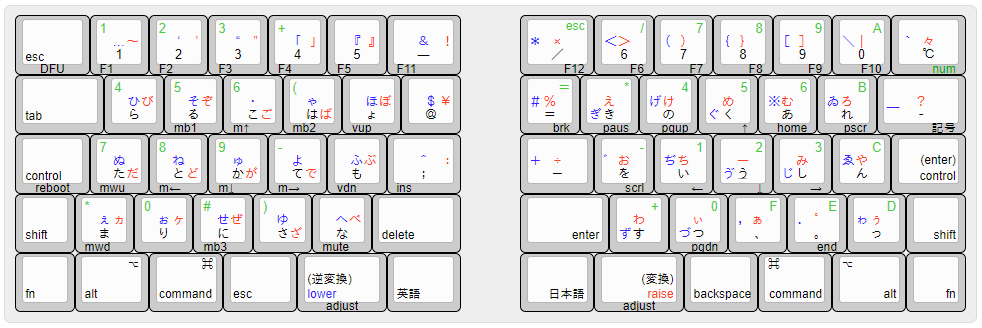
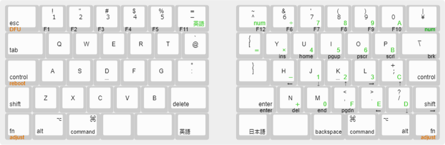

以下のような特徴を持つ自作のキーボードを追加する。

* 物理キー配列

  中央部を1u分開けた7.5u×5uの長方形2つで、16u×5uの[サリチル酸(@Salicylic_acid3)氏](https://salicylic-acid3.hatenablog.com/about) が開発した[65%ケース「GL516」](https://salicylic-acid3.hatenablog.com/entry/gl516-introduction) に収まる形。
JIS配列ベースの[m.tei / ishii (@mtei)氏](https://github.com/mtei) が提唱している[エルゴノミック配列「SemiErgo Layout」](https://github.com/mtei/SemiErgo_Layout) を元にした英語配列と、 [TRON配列](https://www.personal-media.co.jp/utronkb/tron-layout.html) を元にした日本語配列を持つ。
配列の切り替えは上から5段目、左右親指側(全体の中央側)1列目の角にある英語キー・日本語キーで行う。

* 親指シフトキーと変換キー・逆変換キーの共有化

  日本語配列では、[okapies氏](https://github.com/okapies)の[ブログの記事](https://okapies.hateblo.jp/entry/2019/02/02/133953) を参考に、同じく5段2列目に配置した左右の親指シフト(lowerキー・raiseキー)をそれぞれ逆変換キー・変換キーとしても使用できるようにした。
これらのキーを押したまま他の文字キーを押すと左右の親指シフトとしてキーマップのレイヤーを切り替え、単独でタップすると(逆)変換となる。
英語配列ではSpaceキーとして働く。

  
  
  
* 親指位置のキートップ形状

  親指位置のキートップには当初他のキーと同じ凹型のキートップを使用していたが、キートップの角が親指に当たって痛くなるため、凸型のキートップを使用して当たりを柔らかくした。
しかし、親指の感覚は鈍いようで、指が今どこにあるのかが分かりづらく、押し間違いが多かった。
そこで同じく5段3列目に配置したEscとBackspaceの2キーには、親指用の凸型キートップではなく通常の凹型キートップを使用したところ押し間違いが改善した。

* カナ入力、あるいは多バイト文字入力の一方式としてのTRON入力

  日本語文字の入力はGoogle日本語入力の機能を使用して実現した。

  JP109キーボードで使用するキーコードとは別に、JIS X 0208で定義されている全文字に対応するキーコードと、そのキーコードに対応するASCII文字列をキーマップ定義用のヘッダーファイルで定義した。
例えばひらがなの文字は「う：JP__U、"u"」、「ぱ：JP_PA、"pa"」などのように、記号文字は「℃：JP_CELC、"z216e"」、「％：JP_2173、"z2173"」のような組み合わせを定義した。
日本語モードで「う」のキーが押されるとキーボードからは"u"が、「℃」のキーが押されると"z216e"が送信される。
キーボード側では最後に送信したキーコードを覚えておく。

  PC側では上の逆変換"u"→「う」、"z216e"→「℃」などの定義をGoogle日本語入力のローマ字テーブルに追加して、キーボードからの入力をすぐに対応する文字に変換する。
これにより、押し間違えの訂正のためにBackSpaceキーを押したときに、すでに入力した文字を一つずつ消去することができる。

  濁点キー・半濁点キーは繰り返し押すことでトグル動作となるが、例えば「は」→「ば」の変換では「ha」が送信された状態であることをキーボードが覚えているため、BackSpaceに続けて「ba」を送信することでこのような変換を実現している。

* 主なキーマップのレイヤー

  英語配列ではEISUレイヤー、日本語配列ではデフォルトのKANAレイヤーとLOWER、RAISEレイヤーを使用している。
英語・日本語キーはそれぞれEISU・KANAというシンボルを定義してあり、対応するレイヤーへ切り替える。
EISUレイヤーではJP109キーボード相当として動作する。
KANAレイヤーではlower・raiseキーを押したまま他の文字キーを押すと親指シフト機能が働いてLOWER・RAISEレイヤーの文字が入力される。
単独ではそれぞれ逆変換・変換キーとして働く。

* その他

  3段目両手外側1列目はControlキーを配置したが、右ControlキーはタップでEnterとしても機能する。
本来のEnterは右手親指側4段1列目(日本語キーの上)に配置してあり右手人差し指で打鍵するが手癖が生きるようにした。

  NUMLOCKレイヤーでは右手側に十六進テンキー、左手側に電話用テンキーを定義した。

  FNレイヤーでは右手側にカーソル移動やJP109キーボードの特殊キーを、左手側にはマウスキーを配置した。

  ホームポジションマークはADBキーボード時代のMacintoshを元に、F・JではなくD・Kキーの位置に配置した。Semi Ergo配列では親指側のキーが増えているため、F・Jの位置でも良いかもしれない．

  親指の長さは予想以上に短いため、日本語・英語キーが少し押しづらいと感じている。これらのキーを1.5uに、
